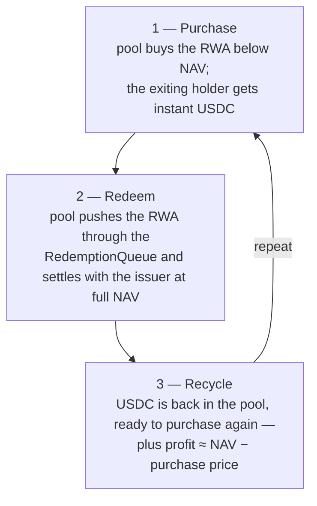
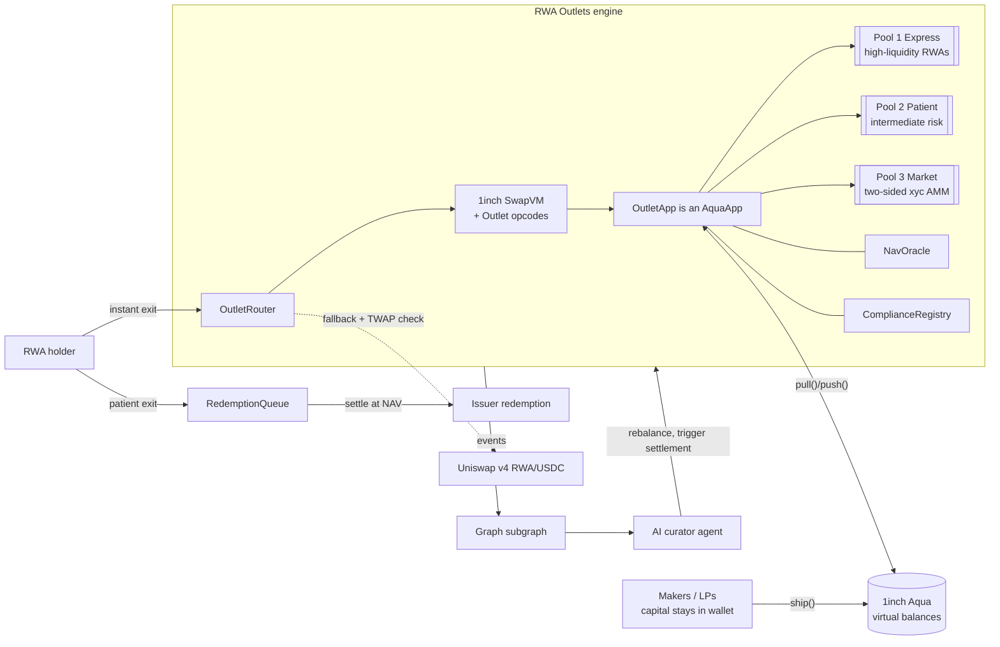

# RWA Outlets — Architecture (page 1 of 2)

**RWA Outlets** is an instant-liquidity market for tokenized real-world assets, modeled on
[Symbiotic Liquid Lane](https://symbiotic.fi/liquid-lane/) but rebuilt as a **1inch Aqua app with
SwapVM programs**. Holders of tokenized RWAs exit to USDC — or buy in — in one transaction through
risk-tiered pools, or queue for NAV settlement and keep the yield. A subgraph-driven AI curator agent manages
the pools, and a Uniswap v4 lane provides secondary-market pricing and fallback routing. Page 2
(`02-engine-spec.md`) is the contract-level spec.

## 1. Problem

Tokenized RWAs (T-bill funds, money-market funds, private credit) redeem on issuer timelines —
T+2 up to 180 days — and secondary markets are thin. The market is ~$33B and mostly cannot be
exited on demand. Holders either wait out the redemption window or dump at unpredictable discounts.

## 2. Reference design: Symbiotic Liquid Lane, and what we change

Liquid Lane (launched June 2026) is the state of the art for instant RWA redemptions:

- **RFQ settlement network** — a redemption request is routed to KYC-verified market makers who bid;
  the winning bid settles atomically: the redeemer gets USDC instantly, the market maker takes the
  RWA position and redeems it with the issuer in the background at NAV.
- **Shared collateral, not per-asset silos** — curator-managed vaults back many issuers/assets at
  once, so liquidity capacity grows with participation instead of fragmenting pool by pool.
- **Capital never idles** — between redemptions vault capital earns in Aave/Morpho; depositors stack
  three yields: redemption spreads + lending yield + Symbiotic app yield.
- **Curators** set risk parameters, supported issuers, and allocation strategy.

We keep the economics and replace the machinery with the hackathon stack:

| Liquid Lane | RWA Outlets | Why |
|---|---|---|
| Offchain RFQ network of market makers | Deterministic onchain quotes from **SwapVM programs** (fixed spread / Dutch-decay auction / xyc AMM) | No offchain quoting infra; quotes are verifiable and fork-testable |
| Shared curator vaults holding deposits | **Aqua virtual balances** — capital stays in maker wallets, one approval backs many strategies | Aqua is natively "shared collateral"; zero deposit/withdraw code |
| Idle capital parked in Aave/Morpho | **Aqua capital reuse** — the same wallet balance concurrently backs both pools and any other Aqua strategy | Same "productive between redemptions" property, enforced by the registry |
| Institutional curators | **AI curator agent** reasoning over our live subgraph, every decision logged with its query + entities | The Graph prize track |
| Issuer-only settlement | Adds a **Uniswap v4 secondary lane** as price sanity check and fallback venue | Covers assets with real secondary markets |

## 3. System overview

The engine in one circle — every pool runs this capital cycle continuously:

How the components implement that loop:

One `OutletApp` (an `AquaApp`), many **pools**. A pool is an Aqua *strategy* (`strategyHash`) with
its own SwapVM program and risk parameters — pricing is isolated per pool, but the **capital is
not**: a maker's single USDC approval backs every pool they ship to. That is the core trick Liquid
Lane markets against "isolated liquidity pools", and Aqua gives it to us for free. Fixed-rate
quotes, decay auctions, and xyc AMM curves are just different strategies drawing on the same
shipped balance.

## 4. The pools — risk-tiered lanes over one shared capital base

### Pool 1 — Express (high-liquidity market)

For blue-chip, short-settlement RWAs (tokenized T-bills / MMF shares, e.g. mTBILL-class assets).
Instant USDC at **NAV minus a tight spread (5–25 bps)**, quoted by a NAV-oracle-anchored program.
Partial fills allowed; per-asset inventory caps.

### Pool 2 — Patient (intermediate risk)

For longer-dated / less liquid RWAs (private credit, 30–180 day issuer windows). Instant USDC via a
**Dutch-decay auction program**: the quoted discount starts tight and decays toward a floor until a
maker-side fill clears, discovering the fair discount onchain (this replaces Liquid Lane's RFQ
bidding). Typical clearing 50–300 bps below NAV.

### Pool 3 — Market (two-sided xyc AMM)

A constant-product `_xycSwapXD` strategy that quotes **both directions** — exits *and* entries
(buying RWAs with USDC) — turning the outlets into a full market rather than an exit-only venue.
Each maker's shipped virtual balances form their own self-custodial mini-pool under the shared
strategy (Aqua's wallet-as-pool model); the router hits the best maker curve. No NAV oracle
dependency, so it keeps quoting between NAV updates and for oracle-less assets.

### Delayed exit — RedemptionQueue ("wait and take the profit")

Holders who can wait deposit the RWA token into the queue, receive a **claim NFT**, and when the
issuer settlement lands they are paid **full NAV including yield accrued while waiting**, minus a
small queue fee. Makers use the same queue to recycle inventory bought at a discount — that
NAV-minus-discount capture is the engine's profit motor.

**Worked example** (rwaCREDIT, NAV 1.0432, 90-day issuer window, 5.3% APY):

| Exit path | You receive (per token) | When |
|---|---|---|
| Pool 2 instant (auction clears at 120 bps) | ~1.0307 USDC | now |
| RedemptionQueue | ~1.0564 USDC (NAV + ~90d accrued yield − 5 bps fee) | ~90 days |

The ~2.5% gap is the price of immediacy — paid by impatient exiters, earned by patient ones and by
the makers who fund instant exits.

## 5. Yield — three streams, mirroring Liquid Lane

1. **Redemption spreads + AMM fees** — every instant exit pays the pool's spread/discount to the
   filling maker; the two-sided Market pool earns swap fees on entries as well as exits.
2. **Capital reuse** — Aqua virtual balances let the same USDC back Pool 1, Pool 2, and any other
   Aqua strategy simultaneously; utilization compounds instead of fragmenting.
3. **NAV capture** — inventory acquired at a discount is pushed through the RedemptionQueue and
   settles at full NAV.

## 6. Sponsor fit

| Sponsor | What in this design qualifies |
|---|---|
| 1inch ($5k Aqua track) | `OutletApp` extends `AquaApp`; three SwapVM programs (fixed-rate, decay auction, xyc AMM) + a **custom opcode set** (NAV-anchored rate, compliance gate) — custom instructions are explicitly scored higher |
| The Graph (Best AI Use Case) | Curator agent's decisions (rebalance, settle, widen spreads) come exclusively from our live subgraph; the query → reasoning → action log is the demo evidence |
| Uniswap | v4 RWA/USDC secondary lane built on a custom hook (`RWAGateHook`): compliance-gated transfers, TWAP sanity check on program quotes, router fallback venue |
